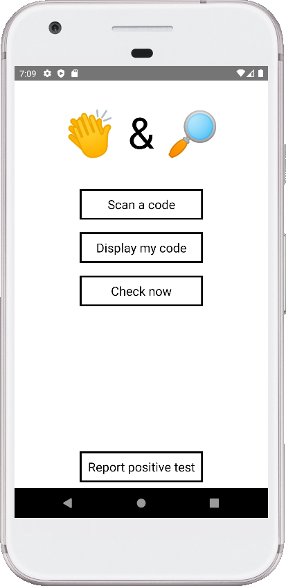
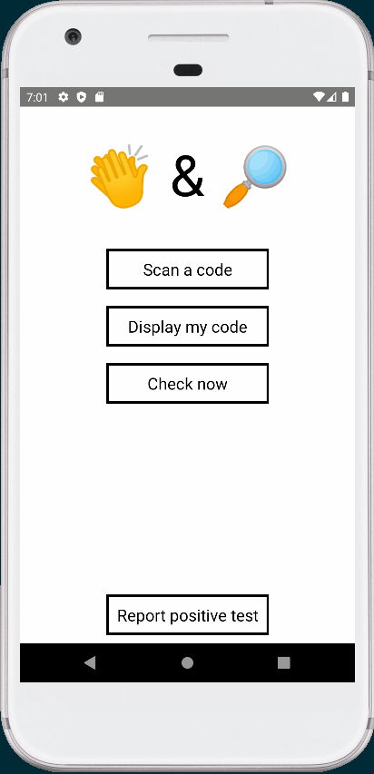
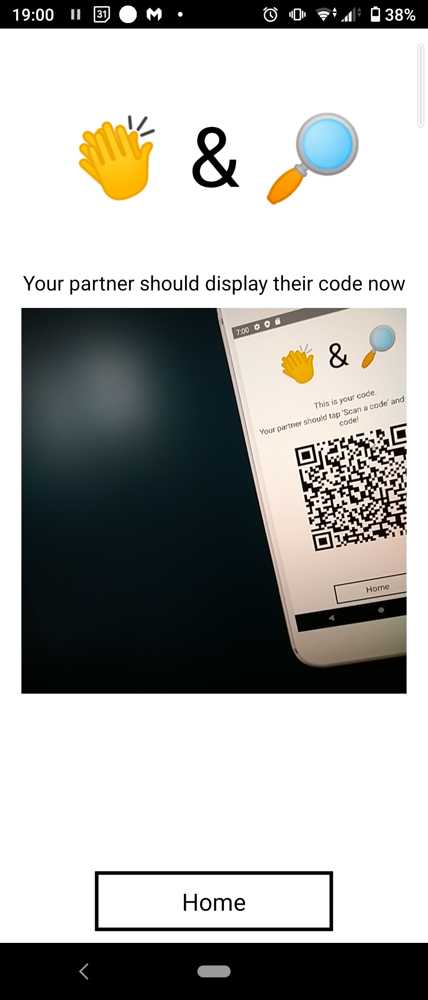
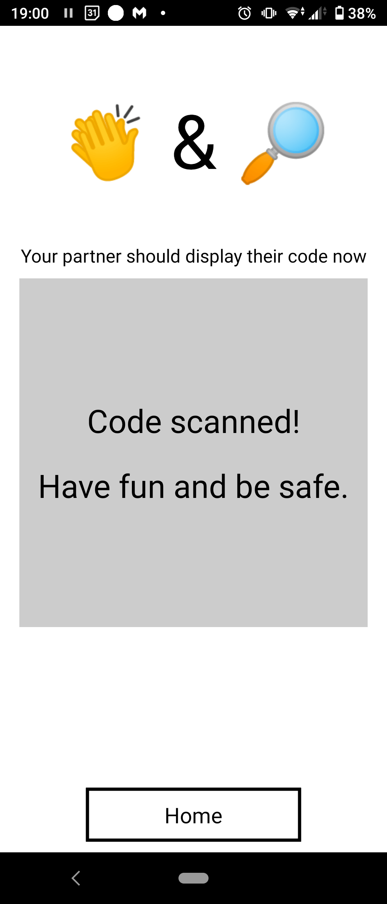
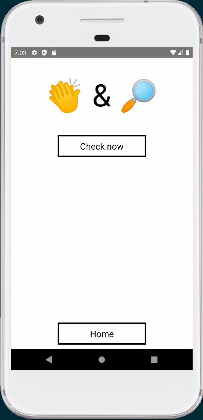
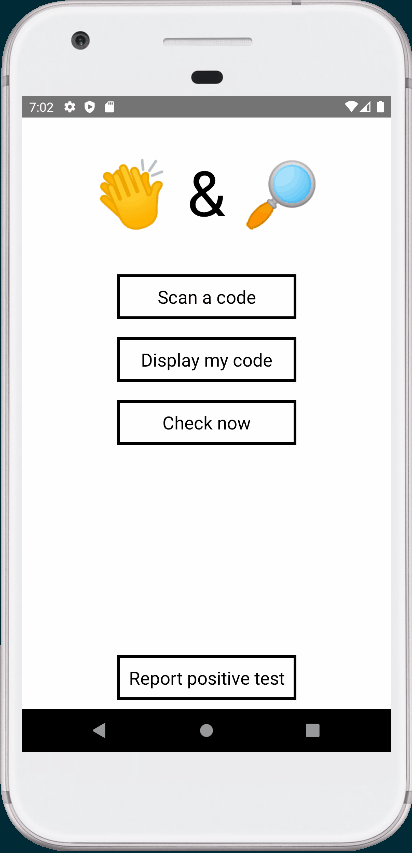

# Clap & Trace

A (mock up of) mobile app to keep you and your 'cule safe. Idea stolen from a 
friend of a friend.

Just for practice with React Native.

## Screenshots

  
Home screen

  

  
Displaying your code

  

  
Scanning a code

  

    
    
  

  
Checking your trace

  

    
    
  

  
Reporting a test result

  

## Retrospect

I should have found an arbitrary reason to use a state management library. 
Nothing this app does can't be handled by a context provider but somehow they 
are all the rage these days.

Should have spent more time trying to get ESLint and Prettier set up with RN. 
The config ballache puts me off still.

## What Next

Actually implement the functionality. The 'what I heard' / 'what I said' method
would be easy enough to implement with only Firebase's Firestore.

Each device keeps a local list of:
- codes it generated ('what I said').
- codes it scanned ('what I heard').

A remote store keeps:
- codes generated by positive cases.

If a user gets an STD test and finds they were positive, they log when they 
might have been positive since. Their device sends off a list of all the 
'what I said' codes from after that date to a remote store (like Firestore).

When a user tabs the _Check Now_ button they compare the remote
store of 'positive cases said' to their own 'what I heard' list. If they find a 
match it indicates they scanned someone's code at a time that they might have 
been positive, and that they should get their own STD test

More information [here](https://www.youtube.com/watch?v=D__UaR5MQao) and
 [here](https://ncase.me/contact-tracing/) about how it works.